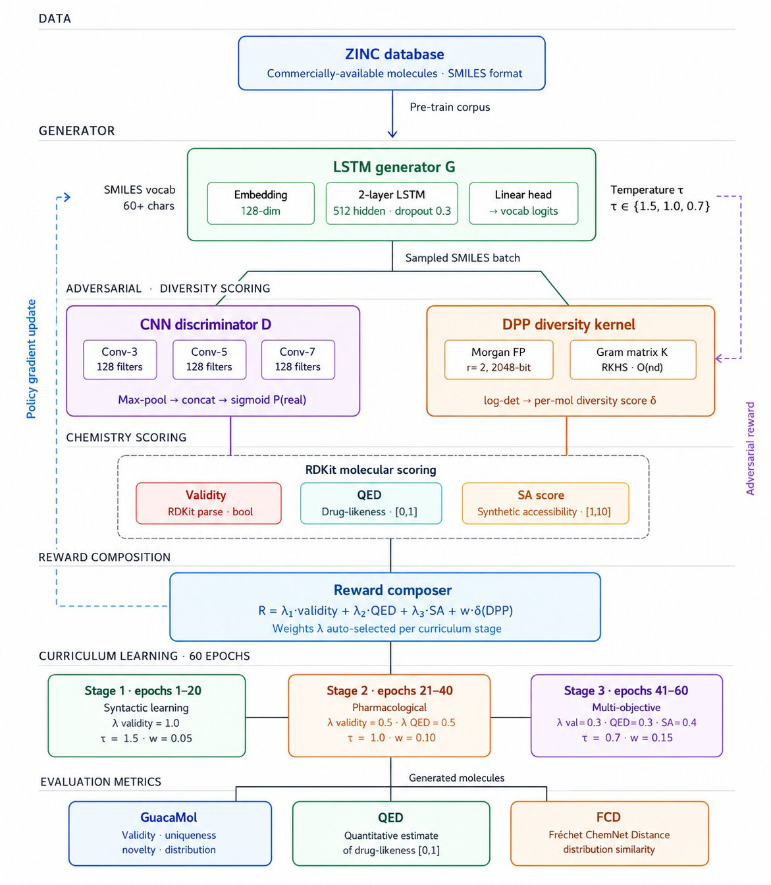

# ORGAN-DPP 🧬

### Automated Molecular Generation with Diversity-Aware Evaluation

> LSTM-based Generative Model with DPP-driven Chemical Diversity & Multi-objective Property Scoring

[](https://organ-dpp.netlify.app/)
[](https://www.python.org/)
[](https://pytorch.org/)
[](https://fastapi.tiangolo.com/)
[](https://www.rdkit.org/)

---

## 🔗 Demo

**[→ Try ORGAN-DPP Live](https://organ-dpp.netlify.app/)**

Generate novel drug-like molecules in real time — evaluate validity, QED, SA, and structural diversity all in a single pipeline.

---

## 📌 Overview

**ORGAN-DPP** is a deep generative model for drug molecule discovery. It combines:

- A **character-level LSTM generator** trained to produce valid SMILES strings
- A **CNN discriminator** (GAN-style adversarial training)
- A **Determinantal Point Process (DPP)** for enforcing structural diversity in generated batches
- A **3-stage curriculum** that progressively introduces QED, SA, and diversity objectives into the RL reward

The system outputs batches of novel molecules scored across four properties: **validity**, **drug-likeness (QED)**, **synthesizability (SA)**, and **structural diversity**.

---

## 🧠 Why DPP?

Standard generative models tend to collapse — producing molecules that cluster in similar regions of chemical space. DPP solves this by computing a **Gram matrix of molecular fingerprints** and using its **log-determinant** as a diversity reward signal.

Molecules that are *more different* from each other yield a higher log-det, so the model is explicitly rewarded for exploring the chemical space broadly.

---

## 🏗️ Architecture



> Full system architecture showing the ZINC data pipeline, LSTM generator, CNN discriminator, DPP diversity kernel, RDKit chemistry scoring, reward composition, 3-stage curriculum learning, and evaluation metrics (GuacaMol · QED · FCD).

---

## 🔄 Pipeline Flow Diagram

```
╔══════════════════════════════════════════════════════════════════╗
║                        ORGAN-DPP PIPELINE                        ║
╠══════════════════════════════════════════════════════════════════╣
║                                                                  ║
║   ┌─────────────────────────────────────────────────────────┐    ║
║   │              ZINC Database (pre-train corpus)           │    ║
║   │          Commercially-available · SMILES format         │    ║
║   └───────────────────────┬─────────────────────────────────┘    ║
║                           │ pre-train                            ║
║                           ▼                                      ║
║   ┌─────────────────────────────────────────────────────────┐    ║
║   │               LSTM Generator G                          │    ║
║   │   Embedding (128) → 2-layer LSTM (512) → Linear head   │    ║
║   │   SMILES vocab: 60+ chars · temperature τ ∈{1.5,1.0,0.7}│   ║
║   └──────────────────┬──────────────────┬────────────────────┘   ║
║                      │ sampled SMILES batch                      ║
║           ┌──────────┘                  └─────────────┐          ║
║           ▼                                           ▼          ║
║  ┌─────────────────────┐              ┌───────────────────────┐  ║
║  │  CNN Discriminator D │              │   DPP Diversity Kernel│  ║
║  │  Conv-3 · Conv-5     │              │   Morgan FP r=2,2048b │  ║
║  │  Conv-7 (128 filters)│              │   Gram matrix K=XᵀX   │  ║
║  │  MaxPool→concat      │              │   log-det → score δ   │  ║
║  │  → sigmoid P(real)   │              └──────────┬────────────┘  ║
║  └────────┬────────────┘                          │               ║
║           │ adversarial reward                    │ diversity δ   ║
║           └─────────────────┐   ┌─────────────────┘              ║
║                             ▼   ▼                                ║
║              ┌──────────────────────────────┐                    ║
║              │      RDKit Chemistry Scoring │                    ║
║              │  Validity · QED · SA Score   │                    ║
║              └──────────────┬───────────────┘                    ║
║                             │                                    ║
║                             ▼                                    ║
║         ┌────────────────────────────────────────┐               ║
║         │            Reward Composer             │               ║
║         │  R = λ₁·validity + λ₂·QED + λ₃·SA    │               ║
║         │        + w·δ(DPP)                      │               ║
║         │  λ weights auto-selected per stage     │               ║
║         └───────────────┬────────────────────────┘               ║
║                         │ policy gradient update                 ║
║            ┌────────────┴──────────────────────┐                 ║
║            │       Curriculum · 60 epochs      │                 ║
║            ├──────────┬──────────┬─────────────┤                 ║
║            │ Stage 1  │ Stage 2  │   Stage 3   │                 ║
║            │ ep 1–20  │ ep 21–40 │   ep 41–60  │                 ║
║            │ Syntactic│ Pharma   │   Multi-obj │                 ║
║            │ λval=1.0 │ val=0.5  │  val=0.3    │                 ║
║            │ τ=1.5    │ qed=0.5  │  qed=0.3    │                 ║
║            │ w=0.05   │ τ=1.0    │  sa=0.4     │                 ║
║            │          │ w=0.10   │  τ=0.7      │                 ║
║            │          │          │  w=0.15     │                 ║
║            └────────────────────┬──────────────┘                 ║
║                                 │ generated molecules            ║
║                                 ▼                                ║
║         ┌──────────────────────────────────────────┐             ║
║         │            Evaluation Metrics            │             ║
║         │  GuacaMol · QED · FCD (Fréchet ChemNet) │             ║
║         └──────────────────────────────────────────┘             ║
╚══════════════════════════════════════════════════════════════════╝
```

---

## 📁 Project Structure

```
ORGAN-DPP/
├── backend/
│   ├── main.py                  # FastAPI app entry point
│   ├── api/
│   │   └── generate.py          # /generate endpoint
│   ├── models/
│   │   ├── generator.py         # 2-layer LSTM SMILES generator
│   │   └── discriminator.py     # CNN discriminator (3/5/7 kernels)
│   ├── dpp/
│   │   └── dpp.py               # ★ Core DPP logic
│   ├── training/
│   │   └── trainer.py           # RL training loop + reward blending
│   ├── curriculum/
│   │   └── curriculum.py        # 3-stage curriculum scheduler
│   └── utils/
│       └── rdkit_utils.py       # Validity, QED, SA, SVG rendering
├── frontend/
│   └── src/app/
│       └── page.tsx             # Next.js UI
├── netlify/
│   └── functions/generate.ts   # Serverless API handler
├── Dockerfile
└── README.md
```

---

## ⚙️ Core Modules

### `dpp/dpp.py` — Determinantal Point Process

The mathematical core of the project.

| Function | Description |
|----------|-------------|
| `mol_to_fp_array(smiles)` | Converts SMILES → 2048-bit Morgan fingerprint vector |
| `compute_diversity_reward(smiles_list)` | Builds Gram matrix K, computes log-det + per-molecule diversity score |
| `select_k_diverse(smiles_list, k)` | Greedy DPP-MAP subset selection — picks k most diverse molecules |

**DPP Math:**
```
X  = stack of normalized fingerprint vectors
K  = X @ Xᵀ              (Gram / kernel matrix)
score_i = 1 - mean(K[i]) (diversity = low similarity to others)
global diversity = log det(K)
```

---

### `models/generator.py` — LSTM Generator

- Vocabulary: 60+ SMILES characters + `<pad>`, `<sos>`, `<eos>` tokens
- Architecture: 2-layer LSTM, embed=128, hidden=512
- Sampling: temperature-scaled softmax, token-by-token autoregressive generation
- Max sequence length: 120 characters

### `models/discriminator.py` — CNN Discriminator

- Parallel `Conv1d` layers with kernel sizes `3`, `5`, `7`
- Max-pooling → concat → sigmoid output
- Trained adversarially against the generator

### `training/trainer.py` — RL Reward Blending

```python
reward = validity_w * validity
       + qed_w      * QED
       + sa_w       * SA
       + div_w      * DPP_diversity   # ← DPP plugged in here
```

### `curriculum/curriculum.py` — 3-Stage Curriculum

| Stage | Epochs | Objectives | Temperature | Diversity Weight |
|-------|--------|------------|-------------|-----------------|
| 1 | 1 – 20 | Validity only | 1.5 | 0.05 |
| 2 | 21 – 40 | Validity + QED | 1.0 | 0.10 |
| 3 | 41 – 60 | Validity + QED + SA | 0.7 | 0.15 |

Diversity weight ramps up progressively across stages.

---

## 🚀 Getting Started

### Prerequisites

```bash
Python 3.9+
PyTorch 2.0+
RDKit
FastAPI
```

### Installation

```bash
git clone https://github.com/Pawan05-mp/ORGAN-DPP.git
cd ORGAN-DPP
pip install -r backend/requirements.txt
```

### Run the Backend

```bash
cd backend
uvicorn main:app --reload
```

API will be live at `http://localhost:8000`

### Run with Docker

```bash
docker build -t organ-dpp .
docker run -p 8000:8000 organ-dpp
```

---

## 📡 API Reference

### `POST /generate`

Generate a batch of molecules.

**Request:**
```json
{
  "batch_size": 64,
  "temperature": 1.0,
  "diversity_weight": 0.1,
  "curriculum_stage": 1
}
```

**Response:**
```json
{
  "run_id": "uuid",
  "molecules": [
    {
      "smiles": "CCO",
      "qed": 0.45,
      "sa": 3.2,
      "diversity": 0.87,
      "validity": true
    }
  ],
  "summary_metrics": {
    "count": 64,
    "valid": 58
  }
}
```

### `POST /train`

Enqueue a background training run.

### `GET /metrics/{run_id}`

Retrieve metrics for a specific generation run.

---

## 📊 Key Metrics

| Metric | Description | Range |
|--------|-------------|-------|
| **Validity** | Parseable SMILES (RDKit) | 0 – 1 |
| **QED** | Quantitative Estimate of Drug-likeness | 0 – 1 |
| **SA Score** | Synthetic Accessibility | 1 (easy) – 10 (hard) |
| **Diversity** | DPP-based structural uniqueness score | 0 – 1 |

---

## 🛠️ Tech Stack

| Layer | Technology |
|-------|-----------|
| Generator | PyTorch LSTM |
| Discriminator | PyTorch CNN |
| Diversity | NumPy DPP (Gram matrix + log-det) |
| Cheminformatics | RDKit (Morgan FP, QED, validation) |
| Backend API | FastAPI |
| Frontend | Next.js + Tailwind CSS |
| Deployment | Netlify (frontend) + Docker (backend) |

---

## 🎓 Academic Context

**Institution:** Manakula Vinayagar Institute of Technology (MVIT), Puducherry
**Department:** Artificial Intelligence & Machine Learning
**Academic Year:** 2025 – 2026

---

## 📄 License

This project is licensed under the terms in [LICENSE.txt](LICENSE.txt).

---

## 🙌 Acknowledgements

- [RDKit](https://www.rdkit.org/) — Open-source cheminformatics
- [ORGAN](https://arxiv.org/abs/1705.10843) — Original GAN + RL molecular generation paper
- [DPP Literature](https://arxiv.org/abs/1207.6083) — Kulesza & Taskar, Determinantal Point Processes for Machine Learning

---

<p align="center">Built with 🧪 by Pawan · <a href="https://organ-dpp.netlify.app/">Live Demo</a></p>
